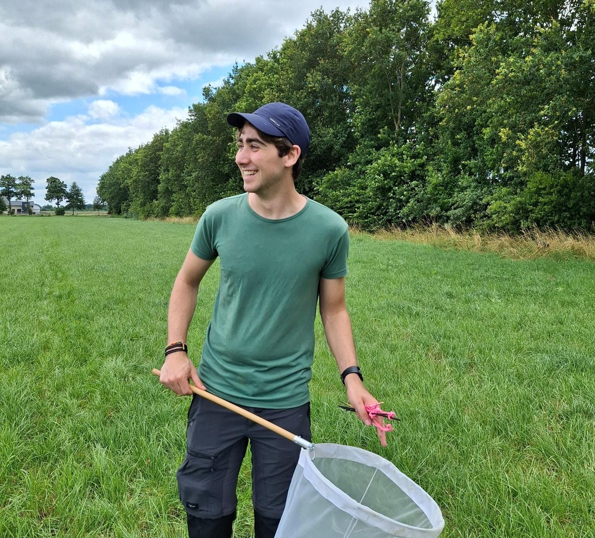

As a small kid I spent hours and hours in the garden of our neighbours. To me, it was a semi-natural paradise where I could find all the tiny bugs my heart desired. From woodlice to butterflies, and from bees to lady bugs. This fascination with the natural world eventually led me to Utrecht University, where I obtained my BSc in biology and MSc in environmental biology. During my studies, the idea of pursueing a PhD had been there almost from the start. I realised how much I enjoy deep-diving into a topic, which is what I get to do now on a daily basis. What I did not expect was that the topic of my research would be linked to agriculture. Looking back, may actually not be a very surprising turn of events. I grew up in a small village in the clay polders of West-Brabant, and worked at a farm for nearly 10 years. The combination of my research interests and hands-on experience in the agricultural sector eventually led to my decision to pursue a PhD focused on biodiversity in regenerative agricultural systems.

{fig-align="center"}

When I get asked - by farmers, colleagues, or friends - what regenerative agriculture is, I still struggle to answer this question. Even after visiting over 25 farms working towards more regenerative management. For me, being regenerative is about the outcomes that are achieved, not about the practices a farmers applies. Even though I struggle to define it, I see that regenerative agriculture is a promising way forward. That is why I am motivated to hopefully show that regenerative agriculture can contribute to conserving and restoring biodiversity, while channeling my inner child once again catching bugs. Not in my neighbours' garden, but in agricultural fields which give hope for a better future for farmers and nature.