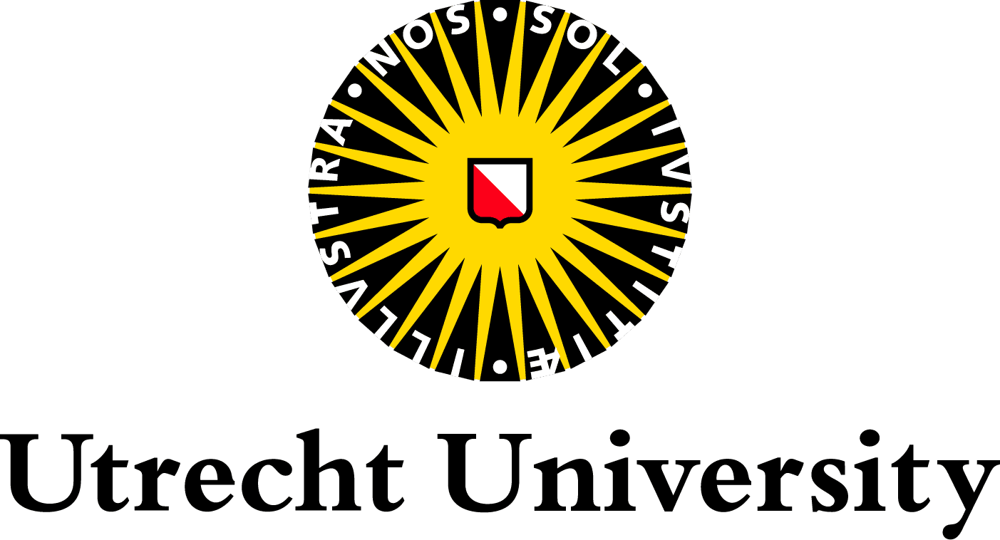

::: column-margin
{fig-align="center" width=50%}

  

{fig-align="center" width=80%}
:::

## About me

I'm a PhD candidate based in Utrecht, at the [Copernicus Institute of Sustainable Development](https://www.uu.nl/en/research/copernicus-institute-of-sustainable-development). Here, I work on quantifying and understanding responses of aboveground biodiversity to regenerative agriculture. My PhD project is part of [ReGeNL](https://regenl.nl/), a transdisciplinary programme aiming to aid in the transition towards a futureproof agricultural sector in the Netherlands. I am supervised by [Prof. dr. Merel Soons](https://www.uu.nl/staff/MBSoons), [Dr. Jerry van Dijk](https://www.uu.nl/staff/JvanDijk2), and [Dr. Sietze Norder](https://www.uu.nl/staff/SJNorder), and work in close collaboration with a [large team of researchers from Dutch universities and research institutes](https://regenl.nl/team/onderzoekers/). You can find more information about my ongoing research in [Research](/research.html) and my [Blog](/blog).

I have a background in ecology, holding a BSc in Biology and an MSc in Environmental Biology from Utrecht University. During my studies I specialised in Ecology and Natural Resource Management and developed an interest in ecological modeling, completing projects on seed dispersal interactions in the Atlantic Forest and forest-savanna tipping in the Amazon Basin.

Outside of science, I spend a lot of time on music. Besides playing saxophone, clarinet, and (bass) guitar I enjoy writing and arranging music for various ensembles, ranging from saxophone quartets to full orchestral arrangements.

## Latest posts

