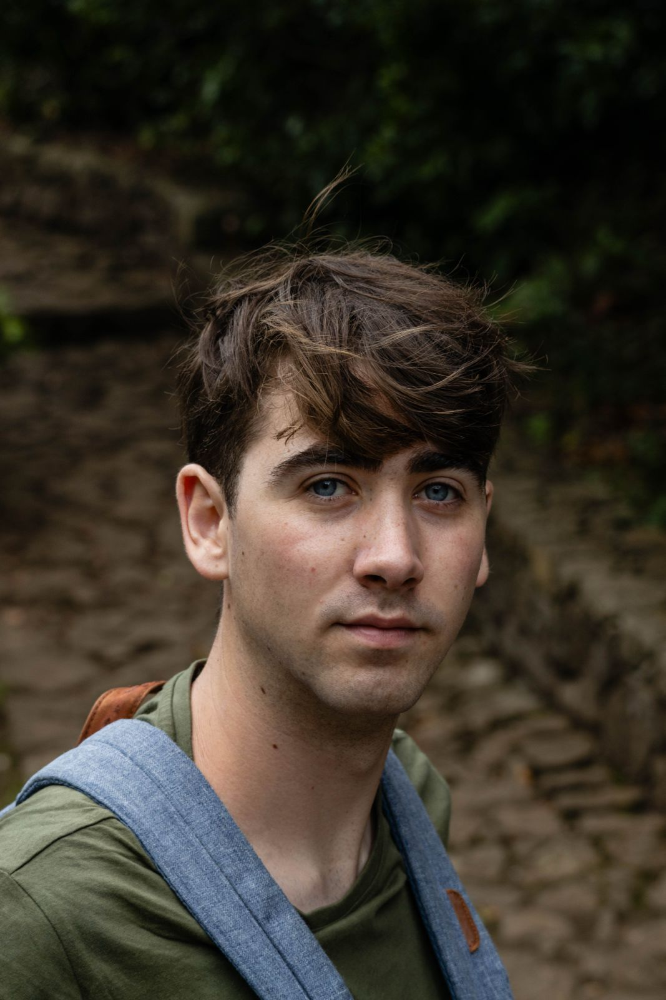

:::::: columns
:::: {.column width="25%"}
::: profile-box

Jorn Knuit

<a href="https://github.com/JornKnuit" target="_blank" aria-label="GitHub">
  <i class="bi bi-github"></i>
</a>

<a href="https://scholar.google.com/citations?user=ZI-OOf0AAAAJ&hl=nl" target="_blank" aria-label="Google Scholar">
  <i class="bi bi-mortarboard-fill"></i>
</a>

<a href="https://www.linkedin.com/in/jorn-knuit-b4246b172/" target="_blank" aria-label="LinkedIn">
  <i class="bi bi-linkedin"></i>
</a>

<a href="https://orcid.org/0009-0004-2350-9237" target="_blank" aria-label="ORCID">
  <i class="bi bi-journal-text"></i>
</a>

<a href="https://www.uu.nl/medewerkers/JJHKnuit" target="_blank" aria-label="Utrecht University profile">
  <i class="bi bi-building"></i>
</a>

<a href="https://bsky.app/profile/yourhandle.bsky.social" target="_blank" aria-label="Bluesky">
  🦋
</a>

<i class="bi bi-envelope"></i>
<a href="mailto:j.j.h.knuit@uu.nl">j.j.h.knuit@uu.nl</a>

_PhD Candidate in Biodiversity Responses to Regenerative Agriculture\
Copernicus Institute, Utrecht University_
:::
::::

::: {.column width="60%"}
**About me**

------------------------------------------------------------------------

I'm a PhD candidate based in Utrecht, at the [Copernicus Institute of Sustainable Development](https://www.uu.nl/en/research/copernicus-institute-of-sustainable-development). Here, I work on quantifying and understanding responses of aboveground biodiversity to regenerative agriculture. My PhD project is part of [ReGeNL](https://regenl.nl/), a transdisciplinary programme aiming to aid in the transition towards a futureproof agricultural sector in the Netherlands. I am supervised by [Prof. dr. Merel Soons](https://www.uu.nl/staff/MBSoons), [Dr. Jerry van Dijk](https://www.uu.nl/staff/JvanDijk2), and [Dr. Sietze Norder](https://www.uu.nl/staff/SJNorder), and work in close collaboration with a [large team of researchers from Dutch universities and research institutes](https://regenl.nl/team/onderzoekers/). 
:::

::: {.column width="15%"}

:::

::::::